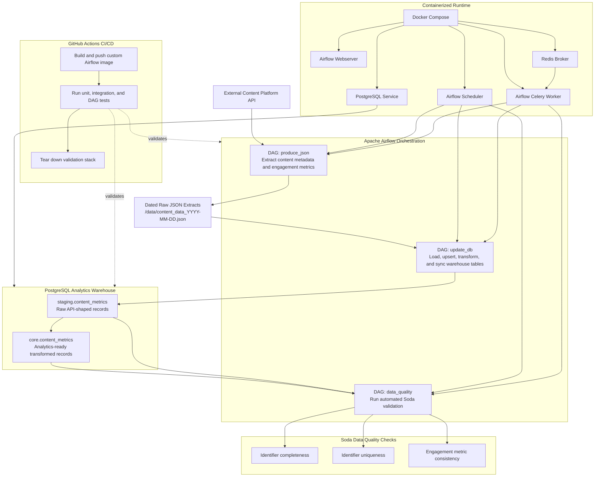

# Architecture Diagram

```mermaid
flowchart TB
    source["External Content Platform API"]
    raw["Dated Raw JSON Extracts<br/>/data/content_data_YYYY-MM-DD.json"]

    subgraph airflow["Apache Airflow Orchestration"]
        produce["DAG: produce_json<br/>Extract content metadata and engagement metrics"]
        update["DAG: update_db<br/>Load, upsert, transform, and sync warehouse tables"]
        quality["DAG: data_quality<br/>Run automated Soda validation"]
    end

    subgraph warehouse["PostgreSQL Analytics Warehouse"]
        staging["staging.content_metrics<br/>Raw API-shaped records"]
        core["core.content_metrics<br/>Analytics-ready transformed records"]
    end

    subgraph checks["Soda Data Quality Checks"]
        completeness["Identifier completeness"]
        uniqueness["Identifier uniqueness"]
        metric_rules["Engagement metric consistency"]
    end

    subgraph runtime["Containerized Runtime"]
        docker["Docker Compose"]
        webserver["Airflow Webserver"]
        scheduler["Airflow Scheduler"]
        worker["Airflow Celery Worker"]
        redis["Redis Broker"]
        postgres["PostgreSQL Service"]
    end

    subgraph cicd["GitHub Actions CI/CD"]
        build["Build and push custom Airflow image"]
        tests["Run unit, integration, and DAG tests"]
        teardown["Tear down validation stack"]
    end

    source --> produce
    produce --> raw
    raw --> update
    update --> staging
    staging --> core
    core --> quality
    staging --> quality

    quality --> completeness
    quality --> uniqueness
    quality --> metric_rules

    docker --> webserver
    docker --> scheduler
    docker --> worker
    docker --> redis
    docker --> postgres

    scheduler --> produce
    scheduler --> update
    scheduler --> quality
    worker --> produce
    worker --> update
    worker --> quality
    redis --> worker
    postgres --> warehouse

    build --> tests
    tests --> teardown
    tests -. validates .-> airflow
    tests -. validates .-> warehouse
```
